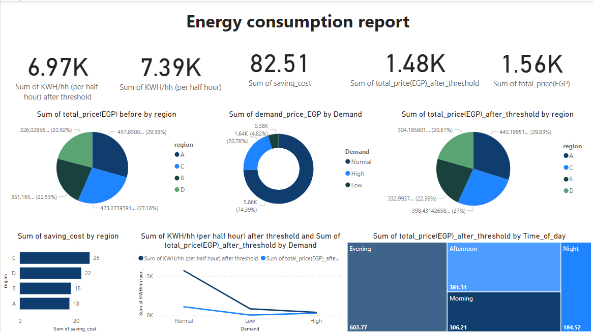
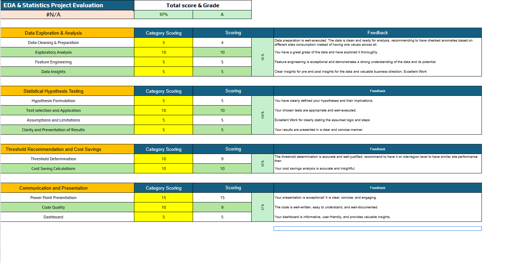

# ⚡ Energy Consumption EDA

# Dashborad:

# my evaluation

# يشسا##
# 🌟 Project Overview
The Energy Consumption Dashboard is an interactive data visualization tool designed to analyze and optimize energy usage patterns across various regions and time periods. It provides actionable insights, identifies cost-saving opportunities, and reveals the impact of regional and temporal factors on consumption behavior.

# ✨ Key Features

# 📊 Interactive Visualizations
Tracks energy consumption trends across regions and times of day

Compares usage before and after applying optimization thresholds

# 💡 Energy Optimization
Applied threshold-based logic to shut down low-consumption cells

Estimated savings in kilowatt-hours (kWh) and cost (EGP)

# 📈 Statistical Analysis
Conducted ANOVA tests to assess:

Impact of regions on energy consumption

Correlation between time of day and usage trends

# 💰 Cost Savings
Calculated total costs before and after optimization

Demonstrated measurable cost reductions via energy efficiency

# 🛠 Tools and Technologies
Language: Python

Libraries: Dash, Plotly, Pandas, Scipy/Statsmodels

Data: Regional energy consumption with time and pricing details

# 🛤 Methodology
# 🔍 Data Cleaning
Fixed missing values, handled outliers, and standardized datetime formats

# 📊 EDA (Exploratory Data Analysis)
Visualized trends by region and time

Detected anomalies in usage patterns

# ⚙️ Threshold Optimization
Calculated the 25th percentile as a threshold

Shut down low-consumption cells for optimization

# 📉 Statistical Testing
Conducted ANOVA to validate the influence of region and time

# 📈 Visualization & Reporting
Built an interactive dashboard to compare pre- and post-optimization performance

# 📊 Results and Insights

# 🌍 Regional Differences
Energy usage varies significantly across regions

# ⏰ Time-of-Day Trends
Peak consumption observed in afternoon hours

# 💵 Cost Savings
Significant cost reduction achieved by shutting down underutilized cells

